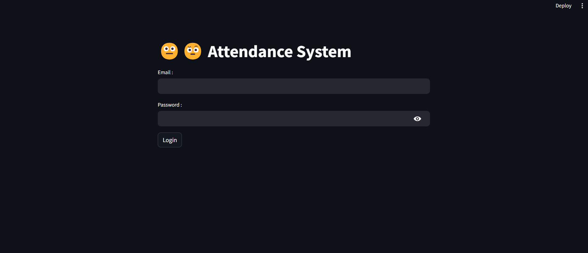

<br/>
<p align="center">
 
<h3 align="center">Attendance System</h3>

<p align="center">
  A face recognition-based attendance system using Siamese networks with a FastAPI backend and Streamlit frontend deployed on Jetson Nano
  <br/>
  <br/>
  <a href="https://github.com/itsskofficial/Computer-Vision">View Demo</a>
  .
  <a href="https://github.com/itsskofficial/Computer-Vision/issues">Report Bug</a>
  .
  <a href="https://github.com/itsskofficial/Computer-Vision/issues">Request Feature</a>
 </p>

</p>


## Table Of Contents

- [About the Project](#about-the-project)
- [Built With](#built-with)
- [Getting Started](#getting-started)
   * [Prerequisites](#prerequisites)
   * [Installation](#installation)
    * [FastAPI Backend](#fastapi-backend)
    * [Streamlit Frontend](#streamlit-frontend)
- [Usage](#usage)
- [Contributing](#contributing)
- [License](#license)
- [Authors](#authors)
- [Acknowledgements](#acknowledgements)

## About The Project



The Attendance System is a project utilizing face recognition with Siamese networks. It features a FastAPI backend for model serving and a Streamlit frontend for user interaction. The system enables efficient attendance tracking through facial recognition.The project was deployed on Jetson Nano device which was independently configured. The instructor can login with their credentials and setup the device so that each student can verify. During verification the request is sent to the server running on the Jetson Nano and it returns the roll no and name of the verified student. The application confirms the verification by text to speech greeting for the student and also by sending a SMS to the instructor. The attendance is automatically marked on the instructor's Google Sheet

## Built With

This section should list any major frameworks that you built your project using. Leave any add-ons/plugins for the acknowledgements section. Here are a few examples.

- [Python](https://python.org)
- [Tensorflow](https://www.tensorflow.org/)
- [FastAPI](https://fastapi.tiangolo.com/)
- [Streamlit](https://streamlit.io/)
- [Jetson Nano](https://developer.nvidia.com/embedded/jetson-nano-developer-kit)

## Getting Started

This is an example of how you may give instructions on setting up your project locally.
To get a local copy up and running, follow these simple example steps.

### Prerequisites

- **pip:**

Ensure you have Python installed, as pip comes bundled with Python distributions.

```sh
# To upgrade pip to the latest version, run:
python -m pip install --upgrade pip
```

## Installation

### FastAPI Backend

1. **Clone the repo**

   ```sh
   git clone https://github.com/itsskofficial/Computer-Vision.git
   ```

2. **Enter into the FastAPI directory**

   ```sh
   cd Projects/AttendanceSystem/backend
   ```

3. **Install libraries**

   ```sh
   pip install -r requirements.txt
   ```

4. **Start the FastAPI server**

   ```sh
   uvicorn app:app --reload --host 0.0.0.0 --port 8000
   ```

### Streamlit Frontend

1. **Enter into the frontend directory**

   ```sh
   cd Projects/AttendanceSystem/frontend
   ```

2. **Install the libraries**

   ```sh
   pip install -r requirements.txt
   ```

3. **Start the Streamlit client**

   ```sh
   streamlit run app.py
   ```

## Usage

The Attendance System is a user-friendly tool for tracking attendance through face recognition. Users can utilize the Streamlit frontend to interact with the system, while the FastAPI backend serves the face recognition model. Deploying on Jetson Nano is efficient as its a powerful edge devie

## Contributors

Thanks goes to these wonderful people:
</br>

<table>
  <tr>
     <td align="center"><a href="https://github.com/itsskofficial"><br /><sub><b>Sarthak Karandikar</b></sub></a><br />💻</td>
    <td align="center"><a href="https://github.com/abhijeetsuryawanshi12"><br /><sub><b>Abhijeet Suryawanshi</b></sub></a><br/> 💻</td>
   
  </tr>
</table>

## Contributing

Contributions are what make the open source community such an amazing place to learn, inspire, and create. Any contributions you make are greatly appreciated.

If you have a suggestion that would make this better, please fork the repo and create a pull request. You can also simply open an issue with the tag "enhancement." Don't forget to give the repository a star! Thanks again!

### Creating A Pull Request

1. Fork the Project
2. Create your Feature Branch (`git checkout -b feature/AmazingFeature`)
3. Commit your Changes (`git commit -m 'Add some AmazingFeature'`)
4. Push to the Branch (`git push origin feature/AmazingFeature`)
5. Open a Pull Request

## License

Distributed under the MIT License. See [LICENSE](https://github.com/your-username/Computer-Vision/blob/main/LICENSE.md) for more information.

## Acknowledgements

- [Nicholas Renotte](https://www.nicholasrenotte.com/)
- [Siamese Network Paper](https://www.cs.cmu.edu/~rsalakhu/papers/oneshot1.pdf)
