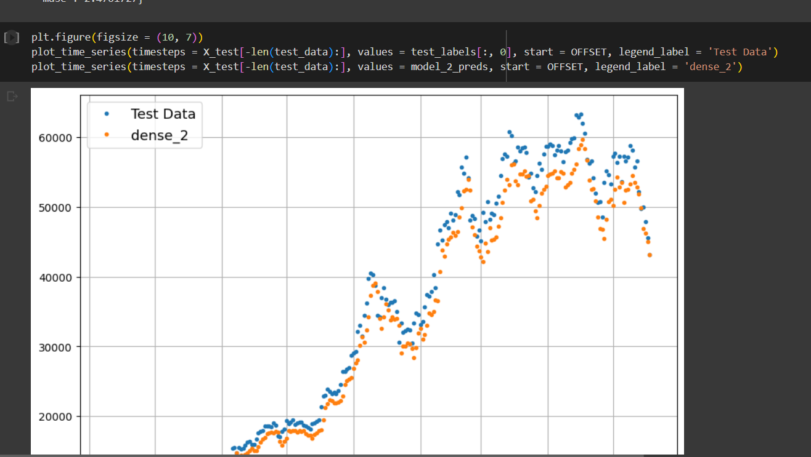

<br/>
<p align="center">
  <h3 align="center">BitPredict</h3>
  <p align="center">
A Bitcoin prediction deep learning project using Python, Tensorflow, Numpy, Matplotlib, and Pandas.
    <br/>
    <br/>
    <a href="https://github.com/itsskofficial/Deep-Learning">View Demo</a>
    .
    <a href="https://github.com/itsskofficial/Deep-Learning/issues">Report Bug</a>
    .
    <a href="https://github.com/itsskofficial/Deep-Learning/issues">Request Feature</a>
  </p>
</p>

 

## Table Of Contents

* [About the Project](#about-the-project)
* [Built With](#built-with)
* [Getting Started](#getting-started)
  * [Prerequisites](#prerequisites)
  * [Installation](#installation)
* [Usage](#usage)
* [Contributing](#contributing)
* [License](#license)
* [Authors](#authors)
* [Acknowledgements](#acknowledgements)

## About The Project



BitPredict is a Bitcoin prediction deep learning project that utilizes Python, Tensorflow, Numpy, Matplotlib, and Pandas. The project aims to predict Bitcoin prices using deep learning techniques, providing insights into potential future price movements.

## Built With

This section should list any major frameworks that you built your project using. Leave any add-ons/plugins for the acknowledgements section. Here are a few examples.

* [Python](https://www.python.org/)
* [Tensorflow](https://www.tensorflow.org/)
* [Numpy](https://numpy.org/)
* [Matplotlib](https://matplotlib.org/)
* [Pandas](https://pandas.pydata.org/)

## Getting Started

This is an example of how you may give instructions on setting up your project locally.
To get a local copy up and running follow these simple example steps.

### Prerequisites

* **pip:**
  
  Ensure you have Python installed, as pip comes bundled with Python distributions.

  ```sh
  # To upgrade pip to the latest version, run:
  python -m pip install --upgrade pip


### Installation

1. **Clone the repo**

    ```sh
    git clone https://github.com/itsskofficial/Deep-Learning.git
    ```

2. **Enter into the directory**
    ```sh
    cd Projects/BitPredict
    ```

3. **Install pip packages**

    ```sh
    pip install -r requirements.txt
    ```

## Usage

BitPredict uses deep learning techniques to predict Bitcoin prices. Users can input historical data, and the model will generate predictions, aiding in decision-making related to Bitcoin investments.

## Contributing

Contributions are what make the open source community such an amazing place to learn, inspire, and create. Any contributions you make are greatly appreciated.

If you have a suggestion that would make this better, please fork the repo and create a pull request. You can also simply open an issue with the tag "enhancement". Don't forget to give the repository a star! Thanks again!

### Creating A Pull Request

1. Fork the Project
2. Create your Feature Branch (`git checkout -b feature/AmazingFeature`)
3. Commit your Changes (`git commit -m 'Add some AmazingFeature'`)
4. Push to the Branch (`git push origin feature/AmazingFeature`)
5. Open a Pull Request

## License

Distributed under the MIT License. See [LICENSE](https://github.com/itsskofficial/Deep-Learning/blob/main/LICENSE.md) for more information.

## Acknowledgements

* [ZTM](https://zerotomastery.io/)
